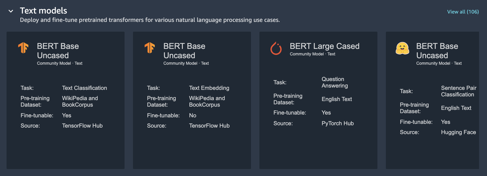
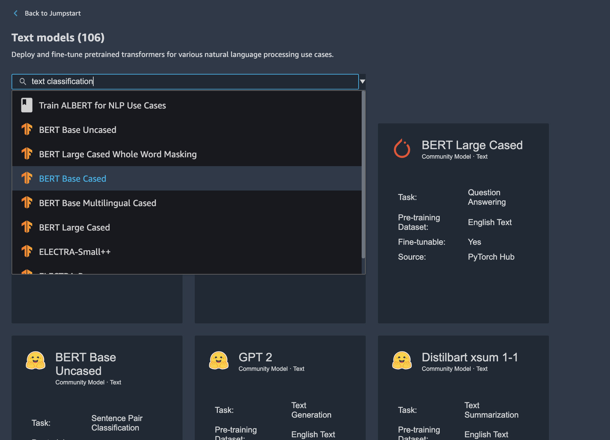
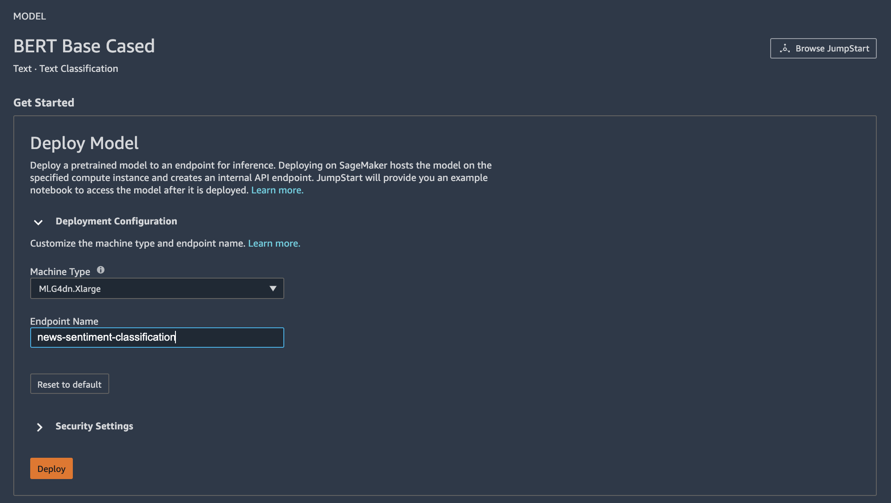
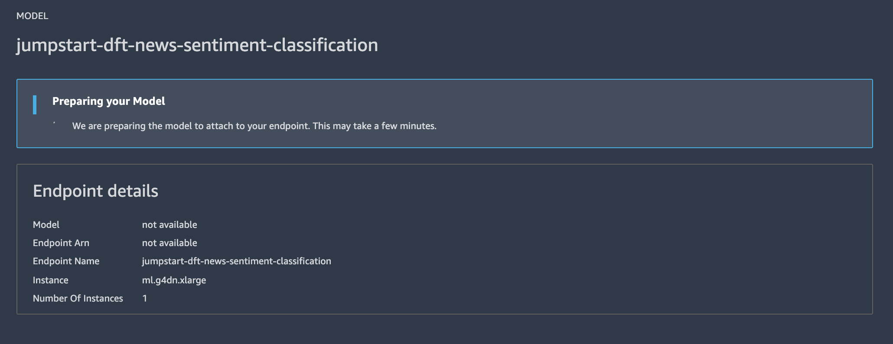
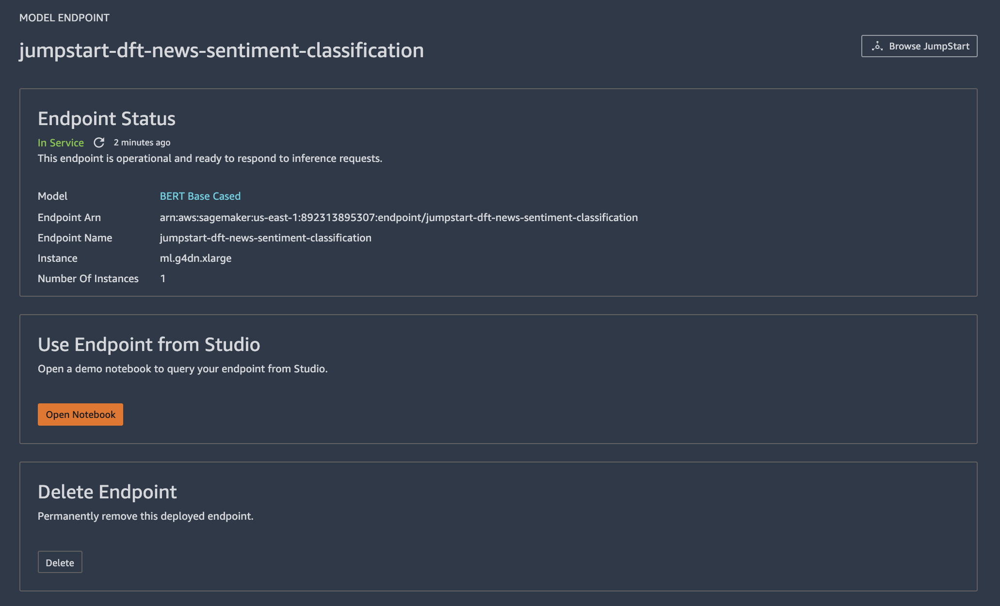

# News Sentiment Classification

## Context:
This dataset (FinancialPhraseBank) contains the sentiments for financial news headlines from the perspective of a retail investor.

## Content:
The dataset contains two columns, `label` and `headline`. The label (sentiment) can be negative, neutral or positive.

## BERT Base Cased:
`BERT` - **Bidirectional Encoder Representations from Transformers** is a transformer-based machine learning technique for natural language processing pre-training developed by Google. BERT was created and published in 2018 by Jacob Devlin and his colleagues from Google. [Wikipedia](https://en.wikipedia.org/wiki/BERT_(language_model))

#### SageMaker Jumpstart:
`Amazon SageMaker JumpStart` is a capability of Amazon SageMaker that accelerates your machine learning workflows with one-click access to popular model collections (also known as **model zoos**), and to end-to-end solutions that solve common use cases.

## Downstream Task:
Multi-class Classification 

## List of pre-trained language models available to be used directly or fine-tuned:
* **BERT Base Cased**
* BERT Base MEDLINE/PubMed	
* BERT Base Multilingual Cased	
* BERT Base Uncased	
* BERT Base WikiPedia and BookCorpus	
* BERT Large Cased
* BERT Large Cased Whole Word Masking	
* BERT Large Uncased Whole Word Masking	
* ELECTRA-Base++	
* ELECTRA-Small++	

## Step by step instructions:

   * For this demo, we will be using SageMaker Jumpstart to use one of its 100s of pre-trained language models directly for text-classification. 
   * You can also fine-tune these language models for various NLP downstream tasks like classification, summarization, question answering etc.
   * For this demo,  we will be using BERT Base Cased pre-trained model to classify FinancialPhraseBank dataset. This dataset contains sentiments for financial news headlines. We will use BERT model to directly classify the headlines into 3 labels.
    * Navigate to the Text models in the Jumpstart view of models.
    
   * Clicking View all takes you to list of 106 text models that we currently support for NLP.
    
   * There are various models that support text classification, for this demo, let us pick BERT Base Cased. Type “text classification” in the search box and choose BERT Base Cased model for text classification (3rd in the results).
    
   * In the model view, choose the machine type you want for deploying. Remember, here we are not doing any fine-tuning, instead, we are directly deploying the pre-trained model as a SageMaker endpoint for real-time inference.
    
   * Click *Deploy*, this kicks off the deployment process and the view looks like the image below:
    
   * Next, it changes to the creation state as show below:
    
   * Once the deployment is done (as shown below), you can click the *Open Notebook* button to take a look at example code that shows how you can invoke this endpoint for classification.
    
   * The workshop repo contains a sample notebook which is a modified version of the above code example. It show cases how to use the deployed endpoint to perform sentiment classification. The notebook can be found [here](https://github.com/arunprsh/no-code-low-code/blob/main/finserv/language/news-sentiment-classification/make-prediction.ipynb).

